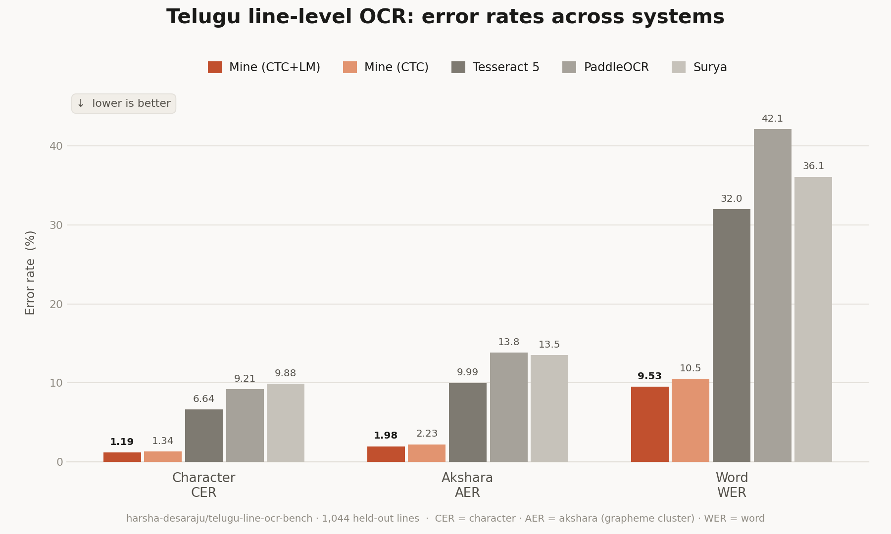
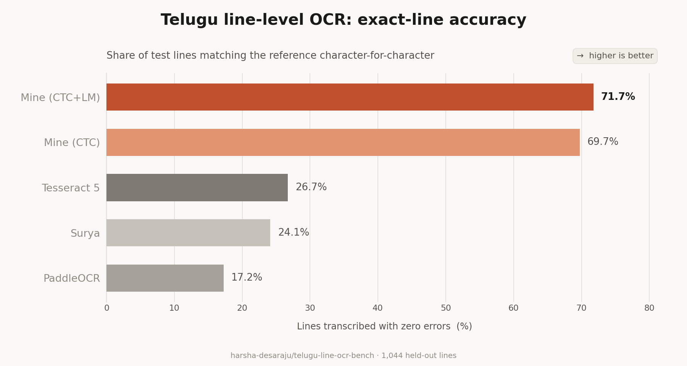

# Telugu OCR

A Telugu line-OCR system trained from scratch — a convolutional CTC image encoder feeding
a grapheme-level language model through cross-attention. Everything here is custom
PyTorch: the architecture, the tokenizer, the synthetic data pipeline, and the corpus of
real book scans it is trained and evaluated on.

On a held-out set of **1,044 human-verified lines** from scanned Telugu books, it reads
substantially better than the general-purpose OCR engines:





A **5.6× lower character error rate** than the strongest baseline, and 2.7× more lines
read exactly right. Reproduce with `python3 -m benchmark.run_benchmark`.

<details>
<summary>The same numbers as a table</summary>

| engine | CER ↓ | akshara ER ↓ | WER ↓ | exact lines ↑ |
|---|---|---|---|---|
| **ours** (joint CTC + LM rescoring) | **0.0119** | **0.0198** | **0.0953** | **71.7%** |
| ours (CTC greedy) | 0.0134 | 0.0223 | 0.1052 | 69.7% |
| Tesseract 5.5 (`tel`, psm 13) | 0.0664 | 0.0999 | 0.3198 | 26.7% |
| PaddleOCR 3.7 (`te`) | 0.0921 | 0.1384 | 0.4214 | 17.2% |
| Surya | 0.0988 | 0.1354 | 0.3610 | 24.1% |

Baselines are given their best measured settings, not their defaults; see
`TesseractEngine`'s docstring for the psm sweep behind that choice. Full per-engine
breakdowns, including alignment counts and the top akshara confusions, are in
`benchmark/benchmark_results.json`.

</details>

---

## Why a grapheme tokenizer

Telugu is an abugida. A single written unit — an *akshara* — is a consonant cluster plus
vowel signs, and it routinely spans several Unicode codepoints: `ప్ర` is three, `శ్రీ` is
four. Scoring or tokenizing at codepoint level therefore charges several errors for one
misread symbol, and asks the model to emit pieces that never appear alone.

So the tokenizer splits on Unicode extended grapheme clusters (`regex.\X`) and maps one
cluster to one token — no BPE, no merges. The vocabulary is the 2,048 most frequent
aksharas; anything rarer falls back to its constituent codepoints. Character error rate
and akshara error rate are both reported throughout, because they answer different
questions.

## Architecture

```
line image (1 × 64 × W)
        │
        ▼
┌───────────────────────┐   6-stage conv stem: height 64 → 1, width ÷ 8
│  ImageEncoderCTC      │   10-layer pre-LN transformer, d=384
│  20.0M params         │   linear CTC head over 2048 aksharas + blank
└───────────┬───────────┘
            │ frame features (B, W/8, 384)
            ├──────────────────────────────► CTC greedy decode ──► text
            │
            ▼  enc_to_dec: 384 → 512
┌───────────────────────┐   16-layer causal LM, d=512, SwiGLU
│  TextDecoder          │   cross-attention on every 2nd block,
│  52.5M params         │   behind a zero-init tanh gate
└───────────┬───────────┘
            ▼
      beam search / joint rescoring ──────────────► text
```

**81.1M parameters total.** The two decoders are complementary and both are kept: CTC is
monotonic and cannot hallucinate, the LM knows Telugu morphology and fixes what CTC
garbles. Joint rescoring — re-ranking the LM's beam by `log P_lm + λ · log P_ctc` — beats
either alone, which is the last row versus the second in the table above.

The cross-attention gate is zero-initialised (`tanh(0) = 0`), so at the start of
fine-tuning the image contributes *nothing* and the model is exactly the pretrained
language model. The image is phased in as the gate learns. This is what makes it possible
to attach a vision encoder to a trained LM without the LM collapsing in the first few
hundred steps.

### Training stages

| stage | starts from | trains | objective |
|---|---|---|---|
| **encoder** | scratch | the CTC encoder | CTC |
| **decoder** | scratch | the grapheme LM | next-token |
| **fine-tune 1** | both of the above | only the cross-attention adapters, gates and bridge | cross-entropy |
| **fine-tune 2** | stage 1 | everything, on three LR tiers | `CE + 0.3 × CTC` |

Stage 1 freezes the backbone and runs its training forward in `.eval()` mode, so the
frozen layers' dropout and stochastic depth do not inject noise into the features the
adapters are learning from. Stage 2 unfreezes and re-enables both, and adds the encoder's
CTC head back as an auxiliary loss so the encoder does not drift off the alignment it was
pretrained on.

## Getting the data

Real labelled Telugu line images barely exist, so most of the work is manufacturing them.

**Synthetic lines.** Text sampled from a Telugu/Sanskrit/English corpus, rendered across
30 fonts at 6 sizes, then degraded until the augmented distribution *contains* the real
one rather than merely averaging to it. The degradation pipeline
(`src/telugu_ocr/data/augment.py`) is calibrated against real crops on eight measured
statistics, and the ordering is load-bearing — binarisation must precede ink spread,
noise must precede resampling, auto-levels must come last. It has a two-sided
ink-preservation backstop, because an akshara whose counters close up is a **wrong label**,
not a hard training example.

**Real lines from Wikisource.** Proofread page scans are cut into lines with Tesseract's
layout analysis, and each line's text is recovered by aligning the page's known transcript
against a concatenated OCR hypothesis. Two other segmenters were built and measured
against it:

| segmenter | corpus CER | struct % | yield @0.10 | yield @0.15 |
|---|---|---|---|---|
| tesseract layout | 0.556 | 11.2 | **40.3%** | **49.6%** |
| PP-OCR detection | 0.553 | 10.1 | 34.1% | 46.2% |
| ink projection | 0.593 | 23.1 | 26.6% | 34.4% |

**Pseudo-labelling.** Book scans are transcribed by several engines at once and kept only
where they agree, with per-line confidence recorded.

Key datasets on the Hub:

| dataset | what it is |
|---|---|
| [`telugu-line-ocr-bench`](https://huggingface.co/datasets/harsha-desaraju/telugu-line-ocr-bench) | the human-verified evaluation set used above |
| [`telugu-wikisource-text-images`](https://huggingface.co/datasets/harsha-desaraju/telugu-wikisource-text-images) | real line crops with aligned transcripts |
| [`sample-dataset-new`](https://huggingface.co/datasets/harsha-desaraju/sample-dataset-new) | synthetic rendered lines |
| [`telugu-sanskrit-english-text-1024`](https://huggingface.co/datasets/harsha-desaraju/telugu-sanskrit-english-text-1024) | the text corpus behind the LM |

## Getting started

Requires Python 3.12 and [uv](https://docs.astral.sh/uv/).

```bash
git clone https://github.com/harsha-desaraju/TeluguOCR.git
cd TeluguOCR
uv sync
```

Transcribe with a trained checkpoint:

```bash
python3 -m scripts.eval.encoder_decoder
```

Score every engine on the benchmark set:

```bash
python3 -m benchmark.run_benchmark
```

Train. Inputs are set inline in each script's `__main__` block — edit them there rather
than passing flags. **The training loops ship with `/kaggle/...` paths** for the vocab and
the pretrained checkpoints, so point those at your own copies before running locally:

```bash
python3 -m src.telugu_ocr.training.loops.ctc          # the CTC image encoder
python3 -m src.telugu_ocr.training.loops.decoder_lm   # the grapheme LM
python3 -m src.telugu_ocr.training.loops.encdec       # fine-tuning; set STAGE = 1 or 2
```

Kaggle and Colab take a single uploaded file rather than a package, so generate one:

```bash
python3 scripts/bundle.py src/telugu_ocr/training/loops/encdec.py -o encdec_kaggle.py
```

That inlines every dependency in order and emits a standalone script. Regenerate it after
changing the source — never edit the bundle.

## Layout

```
src/telugu_ocr/
  models/       image_encoder.py (conv-stem CTC) · text_decoder.py (GPT) · encoder_decoder.py
  tokenizer/    grapheme.py · vocab.py · assets/ (the 2048-akshara vocabulary)
  data/         preprocess.py (line geometry) · augment.py (degradation) · collators.py
  training/     optim.py · trainer.py · callbacks.py · eval_slices.py · loops/
  metrics/      errors.py (CER/AER) · normalize.py
pipelines/      acquire/ · pages/ · synth/ · label/ · publish/ · wikisource/
configs/        model + training configs, and checkpoints.yaml (the artifact registry)
benchmark/      multi-engine scoring, plus engines_ext/ (Tesseract + PaddleOCR adapters)
scripts/        bundle.py (standalone generator) · eval/ (diagnostic runners)
tests/          the regression oracles
```

Two conventions worth knowing before changing anything:

**Build models from `configs/`, never from the dataclass defaults.** The defaults describe
no trained artifact — `CTCEncoderConfig` defaults to 1024px/128 frames while every
checkpoint is 2048/256. Building from defaults fails on a tensor shape (encoder) or
silently ignores 44 tensors (decoder). `configs/checkpoints.yaml` records which config
reproduces which checkpoint.

**There is one implementation of the line geometry** (`resize_line_image`). Getting
preprocessing wrong is silent: no exception, no shape error, the model just reads badly.

## Tests

No pytest runner, but these are real regression nets and should stay green:

```bash
python3 -m tests.test_checkpoint_compat    # models still load every checkpoint, strict
python3 -m tests.micro_train_curve check   # training loss + eval CER unchanged
python3 -m tests.engine_equivalence check  # OCR engines transcribe identically
```

Each compares against a committed baseline. Re-record one only when a change is
intentional and understood — never to silence a failure you have not explained.

## Acknowledgements

Baselines: [Tesseract](https://github.com/tesseract-ocr/tesseract),
[PaddleOCR](https://github.com/PaddlePaddle/PaddleOCR),
[Surya](https://github.com/VikParuchuri/surya). Degradation effects build on
[Augraphy](https://github.com/sparkfish/augraphy). Real text and page scans come from
[Telugu Wikisource](https://te.wikisource.org), whose proofreading volunteers made the
aligned corpus possible.

## License

[MIT](LICENSE).
